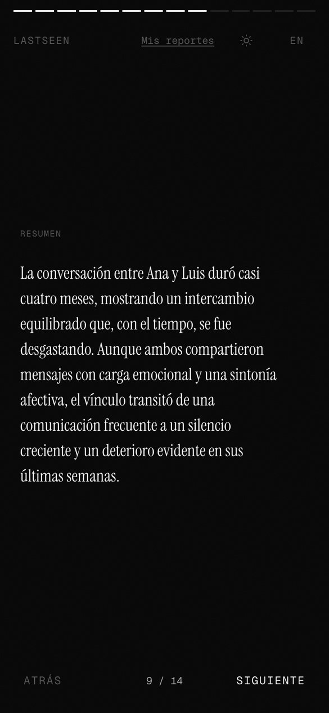

# LastSeen backend

FastAPI and Celery pipeline that parses an exported WhatsApp chat, runs four analyzers (temporal, sentiment, conflict, narrative) and returns a JSON report. The interface lives in [lastseen-front](https://github.com/reeenatamc/lastseen-front).

<table>
<tr>
<td align="center"><br/><sub>Free preview</sub></td>
<td align="center"><br/><sub>Turning point</sub></td>
<td align="center"><br/><sub>Narrative</sub></td>
<td align="center"><br/><sub>Share card</sub></td>
</tr>
</table>

Screenshots use a synthetic chat between two invented people.

## How it works

1. The upload is parsed (WhatsApp on Android and iOS; Telegram and iMessage parsers exist but are not exposed yet) and optionally cut to a date range.
2. A Celery worker runs the analyzers in order. Each one receives the results of the previous ones.
3. Only the report is saved. The chat file is discarded.

| Analyzer | What it measures | External calls |
|---|---|---|
| temporal | Response times, initiative balance, double texts, response decay with a turning point, closing phase, silences, replies delayed more than 3 hours | None |
| conflict | Rupture language (Spanish lexicon), blocks, deleted messages, missed-call bursts, grouped into dated episodes. Only counts and dates leave the analyzer | None |
| sentiment | Score and emotion per message, tone per person, emotional drift, weekly evolution, last 14 days against the rest | Gemini, or local models |
| narrative | Five short chapters written from the aggregated metrics. Message text is never sent | Claude if a key is set, otherwise Gemini |

Sentiment backend is set with `SENTIMENT_BACKEND` (`auto`, `gemini`, `local`). With Gemini, each message is redacted (emails, links and runs of 6 or more digits become markers), cut to 300 characters and sent in batches of 50 without sender or date. If Gemini fails, the local models take over: RoBERTuito for Spanish fused with lexicons and emoji scores, distilbert for other languages.

## Tiers and credits

| Tier | Who | Analyzers |
|---|---|---|
| preview | Guests and accounts without credits | temporal and conflict. No LLM, nothing leaves the server |
| full | Accounts that spend one credit, or premium | All four |

One credit is charged when the upload is queued. It is refunded if the analysis fails, cannot be queued, or finishes without sentiment or narrative; in that last case the report stays locked. Credits are sold in one-time packs through Lemon Squeezy. There is no subscription and no free full report.

## API

```
POST   /api/v1/auth/register        create account
POST   /api/v1/auth/token           login, returns JWT
POST   /api/v1/auth/google          Google Sign-In
GET    /api/v1/auth/me              current user

POST   /api/v1/upload/              upload .txt (max 20 MB), optional date_from / date_to
GET    /api/v1/upload/status/{id}   poll a guest task

GET    /api/v1/analysis/            list reports
GET    /api/v1/analysis/{id}        report (preview or full, by access)
GET    /api/v1/analysis/{id}/status poll
DELETE /api/v1/analysis/{id}        delete

GET    /api/v1/payments/packs       credit packs
GET    /api/v1/payments/credits     balance
POST   /api/v1/payments/checkout    Lemon Squeezy checkout URL
POST   /api/v1/payments/webhook     order_created / order_refunded, HMAC-SHA256
```

Rate limits, kept in Redis, answer 429: uploads 10 per hour per user or IP, login 10 per minute and 50 per hour, registration 5 per hour, Google sign-in 20 per minute. An invalid token on upload answers 401; only a missing header counts as guest.

## Run locally

```bash
python3 -c "import secrets; print('SECRET_KEY=' + secrets.token_urlsafe(48))"
python3 -c "import bcrypt; print('ADMIN_PASSWORD_HASH=' + bcrypt.hashpw(b'<your-password>', bcrypt.gensalt()).decode())"

docker compose up -d --build --wait
docker compose exec api alembic upgrade head
```

The API runs on http://localhost:8000 and the admin panel on `/admin`.

Required in `.env`:

| Variable | Value |
|---|---|
| `DATABASE_URL` | `postgresql+asyncpg://postgres:postgres@db:5432/lastseen` |
| `REDIS_URL`, `CELERY_BROKER_URL`, `CELERY_RESULT_BACKEND` | `redis://redis:6379/0` |
| `SECRET_KEY`, `ADMIN_USERNAME`, `ADMIN_PASSWORD_HASH` | From the commands above |

Optional:

| Variable | Purpose |
|---|---|
| `GEMINI_API_KEY`, `ANTHROPIC_API_KEY` | Narrative and Gemini sentiment |
| `SENTIMENT_BACKEND`, `GEMINI_SENTIMENT_MODEL` | Default `auto` and `gemini-3.5-flash-lite` |
| `GOOGLE_CLIENT_ID` | Google Sign-In |
| `LEMONSQUEEZY_WEBHOOK_SECRET` | Empty disables payments |
| `LEMONSQUEEZY_ALLOW_TEST_MODE` | Process test orders, default false |
| `CREDIT_PACKS` | JSON list of `{key, credits, price_cents, currency, variant_id, checkout_url}` |
| `FREE_CREDITS_ON_SIGNUP` | Default 0 |
| `ENVIRONMENT` | `production` hides `/docs`, requires a `SECRET_KEY` of 32 or more characters and an HTTPS-only admin cookie |
| `TRUSTED_PROXY_HEADER` | Client IP header, only behind your own reverse proxy |
| `ACCESS_TOKEN_EXPIRE_MINUTES` | Default 30 |

Tests:

```bash
docker compose exec -T -e TEST_DATABASE_URL=postgresql+asyncpg://postgres:postgres@db:5432/lastseen_test worker python -m pytest tests/ -q
```

Without `TEST_DATABASE_URL` the tests under `tests/api` are skipped. The first Spanish analysis with the local backend downloads about 1.4 GB of model weights.

## Production

`docker-compose.prod.yml` publishes only the API on 127.0.0.1:8000 (put a TLS reverse proxy in front), keeps Postgres and Redis off the host network, sets a Redis password and runs without code volumes or reload. Set `POSTGRES_PASSWORD` and `REDIS_PASSWORD`, use the same Postgres password in `DATABASE_URL`, and run `docker compose -f docker-compose.prod.yml up -d --build`.

## Privacy

- Messages are not stored. Only the report is saved, and the user can delete it.
- The preview tier sends nothing to third parties.
- The full tier sends redacted, truncated message text to Gemini without sender or date. The narrative model receives only aggregated metrics and participant names.
- Guest results expire from Redis after one hour.
- Logs carry no chat content.

## Licences

Code under MIT. The local sentiment backend uses third-party lexicons with their own terms, including one that is research-only: see [`app/analyzers/lexicons/CITATIONS.md`](app/analyzers/lexicons/CITATIONS.md) before commercial use.
