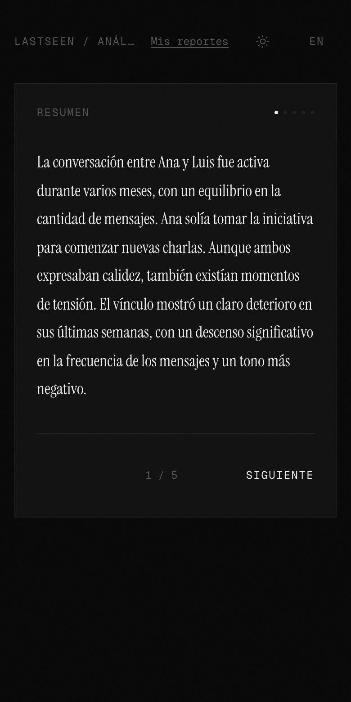
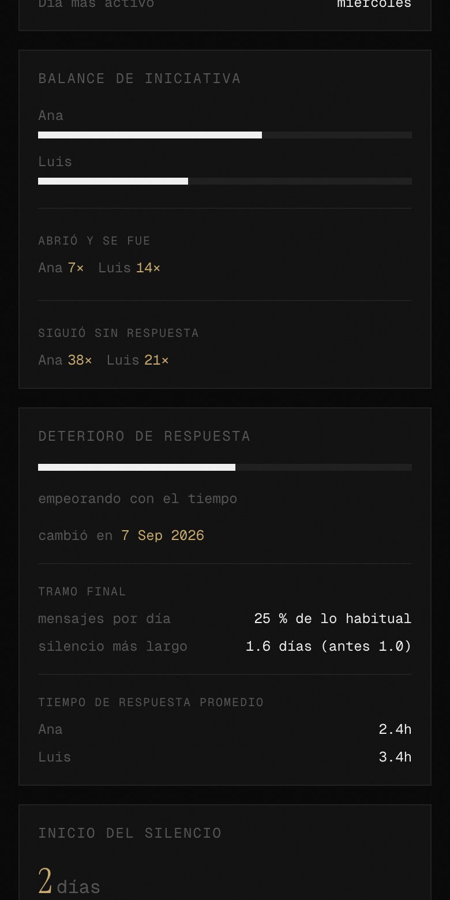

<div align="center">
<br/>

```
▄▄▄▄▄▄▄▄▄▄▄▄▄▄▄▄▄▄▄▄▄▄▄▄▄▄▄▄▄▄▄▄▄▄▄▄▄▄▄
█  ░░░░  ░  ░░░░  ░░░░░░░  ░░░░  ░░░░  █
█  ▄▄▄▄  █  ████  ████████  ▄▄▄▄  ████  █
█  ████  █  ████  ████████  ████  ████  █
█▄▄▄▄▄▄▄▄▄▄▄▄▄▄▄▄▄▄▄▄▄▄▄▄▄▄▄▄▄▄▄▄▄▄▄▄▄▄▄█

     L  A  S  T  S  E  E  N  ·  B A C K E N D
```

<br/>

### *The engine that reads what was left unsaid.*

<br/>

[](.)
[](.)

</div>

---

<br/>

> You upload a chat.
> We tell you when it started dying.

> The backend doesn't store your conversations.
> It reads them, extracts the patterns, and forgets.

<br/>

FastAPI + Celery pipeline that parses exported WhatsApp chats, runs four layers of analysis (**temporal**, **emotional**, **conflict**, **narrative**) and returns a structured JSON that the frontend turns into a story.

<br/>

---

<br/>

<div align="center">

```
 .txt file
    │
    ▼
 PARSER ─────────────────────────────────────────────────────────────
 WhatsApp · Telegram · iMessage                                      │
    │                                                                │
    ▼                                                                │
 ANALYZERS (in memory, raw messages never leave)                      │
    │                                                                │
    ├── temporal.py ──── response time · initiative balance          │
    │                    double text · response decay                │
    │                    silence map · activity patterns             │
    │                    delayed replies (>3h)                       │
    │                                                                │
    ├── sentiment.py ─── language router → hybrid stack              │
    │      │              ┌─ pysentimiento (RoBERTuito ES)           │
    │      ├─ if es ──────┤  + NRC + AFINN lexicons (7.6k words)     │
    │      │              ├─ + intimate-couple vocab (~250 entries)  │
    │      │              └─ + emoji sentiment (Kralj Novak 2015)    │
    │      │                                                          │
    │      └─ else ───── distilbert multilingual (baseline)          │
    │                                                                │
    ├── conflict.py ──── rupture language (ES lexicon) · blocks      │
    │                    missed-call bursts · episodes (counts only) │
    │                                                                │
    └── narrative.py ─── Claude / Gemini  (metrics only, no text)     │
                         5-field emotional interpretation             │
    │                                                                │
    ▼                                                                │
 result JSON ───────────────────────────────────────────────────── DB
```

</div>

<br/>

---

<br/>

## Screenshots

Taken with a synthetic chat between two invented people (Ana and Luis). No real conversation appears here. The interface lives in the lastseen-front repo.

<table>
<tr>
<td align="center"><br/><sub>Free preview (no LLM)</sub></td>
<td align="center"><br/><sub>Narrative</sub></td>
<td align="center"><br/><sub>Temporal metrics</sub></td>
<td align="center"><br/><sub>Share card</sub></td>
</tr>
</table>

<br/>

---

<br/>

## API

```
POST   /api/v1/auth/register        create account
POST   /api/v1/auth/token           login → JWT
POST   /api/v1/auth/google          Google Sign-In (ID token) → JWT
GET    /api/v1/auth/me              current user

POST   /api/v1/upload/              upload .txt (max 20 MB) → queues Celery task
                                    optional date_from / date_to (YYYY-MM-DD, inclusive)
GET    /api/v1/upload/status/{id}   poll task (guests)

GET    /api/v1/analysis/            list analyses
GET    /api/v1/analysis/{id}        full result
GET    /api/v1/analysis/{id}/status lightweight poll (registered users)
DELETE /api/v1/analysis/{id}        delete

GET    /api/v1/payments/packs       public credit pack list
GET    /api/v1/payments/credits     user's current balance and premium status
POST   /api/v1/payments/checkout    Lemon Squeezy checkout URL
POST   /api/v1/payments/webhook     Lemon Squeezy webhooks (HMAC-SHA256)

GET    /admin                       SQLAdmin panel
```

Request limits (HTTP 429 when exceeded, counters kept in Redis):

```
POST /upload/         10 per hour, per user (valid JWT) or per client IP
POST /auth/token      10 per minute and 50 per hour, per IP
POST /auth/register   5 per hour, per IP
POST /auth/google     20 per minute, per IP
```

An invalid or expired token on `/upload/` answers 401; only a missing header counts as guest.

<br/>

---

<br/>

## Analysis levels

Analyses come in two tiers determined by the user's access level.

Preview (guests and users without credits): temporal and conflict analyzers only. Shows chat overview, response times, activity patterns and message length statistics, plus a teaser with counts of what the full report holds. No LLM calls.

Full (premium users or users who spend a credit): all four analyzers including sentiment and narrative. Shows complete metrics including emotional drift, initiative balance, response decay patterns, conflict episodes, and a full five-field narrative interpretation.

Upload charges one credit atomically when queuing. The credit is refunded if the analysis fails or cannot be enqueued. It is also refunded when a full run completes without sentiment or narrative (for example, the LLM was unavailable): the report is delivered as is and the credit returns.

<br>

## What the analyzers measure

**→ Initiative balance**
Who actually starts conversations, not just who messages first, but who breaks the silence after the other person was the last to speak. Plus double text tracking: who followed up unanswered. Auto-flags `low_confidence` on continuous-thread chats so the metric is honest about when it can't speak.

**→ Response decay**
Are response times getting longer? Is reciprocity deteriorating? A score from 0 to 1 with per-ISO-week evolution and a turning point. Catches slow sustained declines, not just one-week cliffs. A separate closing-phase check compares the last three weeks against the earlier baseline (message volume and longest silence), so a chat that was healthy for months and collapsed at the end is not averaged into "stable".

**→ Response time + consistency**
Per-person mean, median, p90 and a `consistency_score`, % of replies within 1h. Low consistency reveals hot-and-cold patterns even when the average looks healthy.

**→ Delayed replies**
Times each person made the other wait more than 3 hours mid-conversation, volume-robust so a high-volume reply burst can't mask occasional ghostings.

**→ Sentiment**
Backend selection via SENTIMENT_BACKEND (auto, gemini, or local).

Gemini backend: Gemini scores each message and labels its emotion. Text is redacted before transmission (email addresses, URLs, and digit runs of 6+ characters replaced with markers), truncated to 300 characters, and sent in batches of 50 with no sender or date. Scores returned are in [-1, +1] with emotion labels (joy, sadness, anger, fear, disgust, surprise, or others). If Gemini fails, falls back to local models.

Local backend: routed by language. Spanish chats use RoBERTuito (pysentimiento, a BETO variant trained on Spanish social media) fused with four signals per message:

```
 base ML score   (pysentimiento)    weight 0.38
 NRC + AFINN ES  (7.6k words)       weight 0.20   abstains if no match
 intimate vocab  (~250 entries)     weight 0.32   abstains if no match
 emoji sentiment (970 emojis)       weight 0.10   abstains if no emoji
                                    weighted fusion, renormalised on abstention,
                                    orthographic emphasis, clamped to [-1, +1]
```

Non-Spanish chats use distilbert multilingual baseline. Result: avg-score uplifts of approximately +0.10 over plain pysentimiento on intimate Spanish chats, typical jump from neutral to positive for the more expressive partner. See app/analyzers/lexicons/CITATIONS.md for lexicon sources and licenses.

**→ Emotional drift**
How aligned both people's tones are over time, with a per-chat drift score and a direction label. Up to 2000 sampled messages, stratified by ISO week with a per-week floor, so the last weeks of a long chat are never dropped. Also reported: a weekly evolution and a comparison of the last 14 days against everything before.

**→ Conflict episodes**
Rupture language (breaking up, block threats, asking for time, withdrawal) matched against a colloquial Spanish lexicon, plus WhatsApp system events: blocks, deleted messages and bursts of unanswered calls. Conflict days merge into dated episodes with a severity, and the last three weeks are compared against the earlier weekly median. Only counts and dates leave the analyzer, the matched text is discarded.

**→ Date range**
The upload accepts an optional `date_from` / `date_to`. Messages outside the range are dropped right after parsing, so every analyzer sees only the selected period.

**→ Narrative**
Five-field interpretation generated by Claude (or Gemini as fallback) (*resumen, dinamica, punto_de_quiebre, estado_actual, reflexion*. Only aggregated metrics reach the LLM) never message content, never names sent to anyone external (the metrics ARE labeled with participant names so the narrative can address them by name; that's the only thing that crosses the wire).

<br/>

---

<br/>

## Coming in v2

**→ Dead chat detection**
The exact moment a conversation stopped being mutual and became one-sided. Not a score. A date and a reason.

**→ Group chat support**
Multi-participant analysis. Who holds the group together. Who went quiet first. The social graph of a conversation.

**→ Telegram and iMessage**
Parsers already built. Full pipeline support coming with v2.

**→ Per-domain calibrated sentiment**
The current hybrid layer is calibrated for intimate couple Spanish. v2 extends to friend chats, family, and work chats, each with its own intimate-vocab module.

**→ Message storage (opt-in)**
For users who want search, history replay, and richer analysis over time. Explicit consent required. Off by default.

**→ Aggregate insights (anonymized)**
Opt-in data layer for trend analysis, when do conversations die, what patterns precede silence, how do response times evolve in different relationship types. Never individual, always aggregate.

<br/>

---

<br/>

## Stack

| Layer | Technology |
|---|---|
| API | FastAPI · Python 3.11 · Uvicorn |
| Queue | Celery · Redis (prefork pool, soft/hard time limits) |
| Database | PostgreSQL · SQLAlchemy 2.0 · Alembic |
| Parsers | WhatsApp (Android + iOS) · Telegram · iMessage |
| NLP base | HuggingFace Transformers · `pysentimiento` (RoBERTuito ES) · distilbert multilingual |
| NLP overlay | NRC + AFINN ES lexicons · Emoji Sentiment Ranking · curated intimate-Spanish vocab |
| Language ID | `langdetect` (seeded, deterministic) |
| LLM | Anthropic Claude (primary) · Google Gemini (fallback for narrative and sentiment), both with explicit 60 s timeouts |
| Sentiment | Gemini (optional, via SENTIMENT_BACKEND) or local models (pysentimiento ES + distilbert multilingual) |
| Payments | Lemon Squeezy with HMAC-SHA256 webhook verification |
| Admin | SQLAdmin |
| Auth | JWT · bcrypt · Google Sign-In (ID-token verification) |
| Deploy | Docker · Railway → AWS |

<br/>

---

<br/>

## Repo layout

```
app/
├── api/v1/routes/        auth · upload · analysis · payments
├── core/                 config · database · dependencies (DI)
├── models/               SQLAlchemy: user · analysis · message
├── parsers/              base + whatsapp/telegram/imessage
├── analyzers/
│   ├── temporal.py       pure functions over parsed messages
│   ├── sentiment.py      language router + hybrid Spanish stack
│   ├── conflict.py       rupture language + system events → episodes
│   ├── narrative.py      Claude/Gemini call with 60 s timeout
│   └── lexicons/         hybrid sentiment overlay + rupture lexicon
│       ├── lexicon_es.csv      NRC + AFINN merged (7.6k words)
│       ├── emoji_sentiment.csv Emoji Sentiment Ranking 1.0
│       ├── intimate_es.py      curated couple-chat vocab (~250)
│       ├── rupture_es.py       rupture-language patterns (ES)
│       ├── loader.py           lazy cached CSV loaders
│       ├── scorer.py           4-layer late-fusion scorer
│       └── CITATIONS.md        sources + licenses (read this!)
├── workers/              pipeline.py + Celery tasks.py
└── admin/                SQLAdmin views
tests/
├── parsers/              format-specific parser tests
├── workers/              date-range filter of the pipeline
└── analyzers/
    ├── test_temporal.py · test_sentiment.py · test_conflict.py · test_narrative.py
    └── lexicons/test_scorer.py   25 unit tests for the hybrid stack
```

<br/>

---

<br/>

## Run locally

```bash
# 1. Generate secrets for .env
python3 -c "import secrets; print('SECRET_KEY=' + secrets.token_urlsafe(48))"
python3 -c "import bcrypt; print('ADMIN_PASSWORD_HASH=' + bcrypt.hashpw(b'<your-password>', bcrypt.gensalt()).decode())"

# 2. Create .env (required keys)
#    DATABASE_URL=postgresql+asyncpg://postgres:postgres@db:5432/lastseen
#    REDIS_URL=redis://redis:6379/0
#    CELERY_BROKER_URL=redis://redis:6379/0
#    CELERY_RESULT_BACKEND=redis://redis:6379/0
#    SECRET_KEY=...                  (from step 1)
#    ADMIN_USERNAME=admin
#    ADMIN_PASSWORD_HASH=...         (from step 1)
#    ACCESS_TOKEN_EXPIRE_MINUTES=10080   (7 days; default 30 min is too short for the analysis loop)
#    ANTHROPIC_API_KEY=...           (optional. Gemini used as fallback for narrative)
#    GEMINI_API_KEY=...              (optional. Used for fallback narrative and optional sentiment)
#    GOOGLE_CLIENT_ID=...            (optional, required only for Google Sign-In)
#    SENTIMENT_BACKEND=auto           (auto, gemini, or local; auto picks gemini if GEMINI_API_KEY is set)
#    GEMINI_SENTIMENT_MODEL=gemini-3.5-flash-lite  (used only if SENTIMENT_BACKEND is gemini or auto with key set)
#    LEMONSQUEEZY_WEBHOOK_SECRET=...  (empty means payments disabled; required for order webhook processing)
#    LEMONSQUEEZY_ALLOW_TEST_MODE=false   (set true to process test orders; normally test orders are ignored)
#    CREDIT_PACKS=[]                  (JSON array of {key, credits, price_cents, currency, variant_id, checkout_url})
#    FREE_CREDITS_ON_SIGNUP=0         (credits granted to new registered users)
#    ENVIRONMENT=development          (development or production; production hides /docs, requires SECRET_KEY of 32+ chars, HTTPS-only admin cookie)
#    TRUSTED_PROXY_HEADER=            (empty uses the connection IP; set CF-Connecting-IP or X-Forwarded-For only behind your own reverse proxy that overwrites it, otherwise clients can spoof it and dodge the limits)
#    RATE_LIMIT_STORAGE_URI=          (empty uses REDIS_URL)

# 3. Bring up the stack (api · worker · postgres · redis)
docker compose up -d --build --wait

# 4. Apply migrations (first time only)
docker compose exec api alembic upgrade head
```

```
API     → http://localhost:8000
Admin   → http://localhost:8000/admin
DB      → localhost:5433
Redis   → localhost:6380
```

Run the test suite:

```bash
docker compose exec -T -e TEST_DATABASE_URL=postgresql+asyncpg://postgres:postgres@db:5432/lastseen_test worker python -m pytest tests/ -q
```

This runs all tests including tests/api (which require the test database URL). Without TEST_DATABASE_URL, tests/api are skipped. The count printed at the end is the total tests run.

Common commands:

```bash
docker compose logs -f api worker          # tail api + worker logs
docker compose exec api alembic revision --autogenerate -m "msg"   # new migration
docker compose down                        # stop everything (keeps volume)
docker compose down -v                     # stop + drop DB volume
```

Production: `docker-compose.prod.yml` publishes only the api, on 127.0.0.1:8000 (put a TLS reverse proxy in front), keeps db and redis off the host network, protects Redis with a password, runs without code volumes or `--reload`, and restarts services unless stopped. Set `POSTGRES_PASSWORD` and `REDIS_PASSWORD` in the environment, make `DATABASE_URL` in `.env` use the same Postgres password, and run `docker compose -f docker-compose.prod.yml up -d --build`. `.dockerignore` keeps `.env` and `.git` out of the image.

**First-run note:** the worker downloads ~1.4 GB of HuggingFace model weights on the first Spanish analysis (RoBERTuito sentiment + emotion). Subsequent runs reuse the in-container cache.

<br/>

---

<br/>

## Privacy, by design

- Raw messages are never stored permanently (the messages table exists for future opt-in features only, currently unused by the pipeline)
- Message content never leaves the worker process except when using Gemini sentiment, which receives redacted and truncated text
- Celery task results expire after one hour, then are removed from Redis
- Worker logs contain no chat content or analysis results (result repr is zero-sized)
- Claude/Gemini receive only aggregated metrics: counts, percentages, response times, drift scores, participant names; never message text
- Time limits on every external call (Anthropic and Gemini SDKs configured with timeout=60 s) so a hung API can never block the worker
- Opt-in data features require explicit user consent at every step

*You share something intimate. We treat it that way.*

<br/>

---

<br/>

## Citations

The hybrid sentiment scorer stands on four published resources. **Read [`app/analyzers/lexicons/CITATIONS.md`](app/analyzers/lexicons/CITATIONS.md) before any commercial use**, the NRC lexicon is licensed for research-only and requires a separate agreement for commercial deployment.

- Kralj Novak P. et al. *Sentiment of Emojis.* PLOS ONE (2015). CC BY-SA 4.0.
- Mohammad S.M., Turney P.D. *Crowdsourcing a Word-Emotion Association Lexicon.* Comp. Intelligence (2013). Research-only.
- Nielsen F.Å. *A new ANEW.* ESWC (2011). ODbL.
- Aragón M.E. et al. *Improved emotion recognition in Spanish social media through the incorporation of lexical knowledge.* Future Generation Computer Systems (2020)., methodology reference for the hybrid lexicon-ML fusion.

<br/>

---

<br/>

## Business model

Pay per report, no free full analyses. Anyone can upload a chat and get the preview tier, which runs no LLM and costs nothing to serve. A full report costs one credit, spent on upload and refunded if the analysis fails. Credits are sold in one-time packs; there is no subscription and no advertising.

Payments via Lemon Squeezy: credit packs are configurable per deployment, idempotent by order ID, with webhook events for order_created and order_refunded. Test mode orders are ignored unless LEMONSQUEEZY_ALLOW_TEST_MODE is enabled.

The anonymized aggregate layer is a separate data product, opt-in, never tied to individual users, sold as trend intelligence to researchers and product teams.

<br/>

---

<br/>

<div align="center">

```
━━━━━━━━━━━━━━━━━━━━━━━━━━━━━━━━━━━━━━━━━━━━━━━
  v0.1  parsers + temporal analyzer   [ ████████ ]
  v0.2  sentiment + pipeline + API    [ ████████ ]
  v0.3  narrative + hybrid sentiment  [ ████████ ]
  v0.4  payments (Lemon Squeezy)             [ ░░░░░░░░ ]
  v1.0  public launch                 [ ░░░░░░░░ ]
  v2.0  dead chat · groups · opt-in   [ ░░░░░░░░ ]
━━━━━━━━━━━━━━━━━━━━━━━━━━━━━━━━━━━━━━━━━━━━━━━
```

<br/>

*Currently in development.*

<br/>

---

*The data was always there.*
*LASTSEEN just knows how to read it.*

</div>
